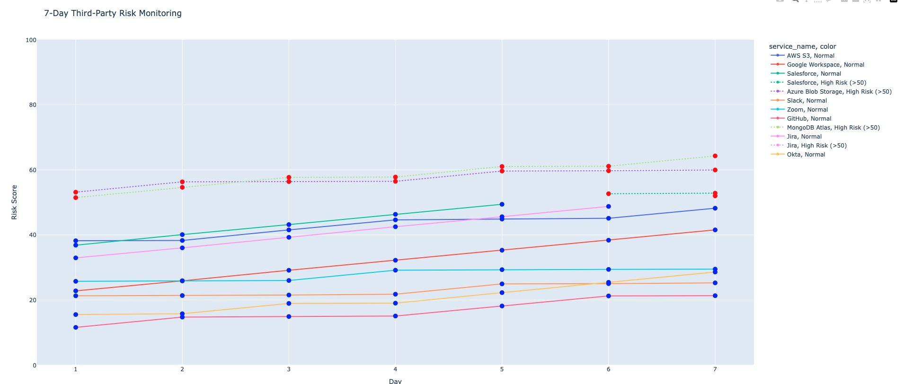

# Tenchi Third-Party Risk Monitoring Project

This project simulates a **7-day monitoring of third-party services** to track cyber risk scores. It is inspired by Tenchi's focus on **Third-Party Cyber Risk Management (TPCRM)**.

## Project Features

- Simulates changes in:
  - Exposed ports
  - SSL expiry
  - Known vulnerabilities
  - Security headers
- Calculates **weighted risk scores** for each service
- Highlights high-risk services (`risk_score > 50`)
- Saves daily CSVs in `results/`
- Provides an **interactive Plotly dashboard** to visualize trends

## Folder Structure
tenchi_risk_project/
│
├── data/ # CSV files with third-party service info
│ └── third_party_services.csv
├── scripts/ # Python scripts
│ ├── risk_assessment.py
│ └── dashboard.py
├── docs/ # Documentation and images
│ └── dashboard.png
└── results/ # Generated daily monitoring CSVs
